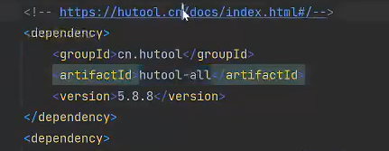

**项目介绍**

聚合搜索、搜索不同站点的数据 --> 来自不同网站的数据。需要统一的前后端。

**技术栈**

前端

- Vue
- Ant Design Vue
- Lodash

后端

SpringBoot

Mysql


**业务流程**

什么是防抖节流？

**项目安排**

初始化

**前端初始化**

ant design of vue

1、pm 安装vue脚手架

2、创建项目


- 选择自定义技术栈 vue版本3.x
- Bable TS router linter/formattor 
- class style 选择no ；整合ts 选择yes
- 路由选择hash模式 选择no
- 语法校验选择prettier，校验时机（save时）
- 配置分离 选择默认
- 是否保存预设 不保存

3、安装组件库

找找vscode是否有prettier插件 	

目录建议别用中文


存在的问题：脚手架安装  清除缓存然后重新安装

prettier格式化插件格式化代码，不然代码检测prettier 发现不规范会报错

**后端初始化**

利用springbootinit模板创建项目

mysql连接

基本功能完成


**前端页面开发**

路由 主页 setup是什么

主页：

搜索框  tab标签页

组件栏：

帖子列表 PostList.vue

用户列表 UserList.vue

图片列表 PictureList.vue


单向改变状态

url => 页面状态

动态路由

AXIOS 安装 引入


HTTPClient 接口方式获取文章

hutoolAll



数据抓取快速开始

```java
String json = "{\"current\":1,\"pageSize\":8,\"sortField\":\"createTime\",\"sortOrder\":\"descend\",\"category\":\"文章\",\"reviewStatus\":1}";
        String url = "https://www.code-nav.cn/api/post/search/page/vo";
        String result = HttpRequest
                .post(url)
                .body(json)
                .execute()
                .body();
        Map<String, Object> map = JSONUtil.toBean(result, Map.class);
  JSONObject data = (JSONObject) map.get("data");
        if(data == null){
            log.warn("fetchInit data is null，please check！！！");
        }else{
            JSONArray records = (JSONArray) data.get("records");
            ArrayList<Post> postList = new ArrayList<>();
            for(Object record:records){
                JSONObject tempRecord = (JSONObject) record;
                Post post = new Post();
                post.setTitle(tempRecord.getStr("titile"));
                post.setContent(tempRecord.getStr("content"));
                JSONArray tags = (JSONArray) tempRecord.get("tags");
                if(BeanUtil.isEmpty(tags)){
                    log.error("tags is null！！！");
                }else {
                    List<String> tagList = tags.toList(String.class);
                    post.setTags(JSONUtil.toJsonStr(tagList));
                }
                post.setUserId(Long.parseLong(tempRecord.getStr("userId")));
                postList.add(post);
                log.info("捕获结果：post---》 {}",post);
            }
            boolean resultInsert = postService.saveBatch(postList);
            if (resultInsert) {
                log.info("插入成功：{}",resultInsert);
            } else {
                log.info("插入失败：{}",resultInsert);
            }
        }

```

数据抓取类实现了 CommandLineRunner ，

springboot启动一次，本类运行依次，运行方法重写run（）方法


**抓取渲染好的页面：**

jsoup 抓取html页面数据的三方库


**聚合结构**：

前端统一请求接口，后端分别来请求不同的内容，然后统一返回给前端。


**聚合接口优化**：

在每次请求时，统一的接口都会返回所有的数据结果

我们不需要在选择用户的时候查询其他数据，就可以通过定义type类型字段，前端传到后端之后，后端然后在进行判断查询那个接口，返回数据。

ES

数据同步

**设计模式**：

1、门面模式

```
业务代码繁重，应该单独抽象到其它单独的业务逻辑类中
```

酒店前台的例子

controller的逻辑处理 交给门面facade


**适配器模式：**

```
然后就是涉及统一资源的适配问题，为了统一外来的资源接口，我们采用适配器模式，指定统一的搜索接口，方便维护和拓展
```

统一的数据源接入标准

为搜索结果的不同的数据，创建不同的数据源接口 DataSrouce

switch用map来替换。

通过中间适配转换，让系统进行对接


**注册器模式：（本质上也是单例模式）**

通过一个map或其他类型提前存储好需要调用的对象

效果：简化代码，使结构更清晰


**ElasticStack（一套技术栈）7.17：**

一整套 数据整合=》提取=》存储=》使用

各组件：

​	beats	采集数据

​	logstash 抽取、转换数据

​	elasticSearch（存储、查询数据）

​    kibana（可视化es数据）


**安装ES:**	

如果是一套技术栈，则一定要保障版本一致

**安装 Kibana：**

下载地址：https://artifacts.elastic.co/downloads/kibana/kibana-8.14.0-windows-x86_64.zip

elastic.co/guide/en/***


**Elastic简介：**	

​	Index 索引 => MySQL 里的表（table）

​	建表、增删改查（查询需要花费的学习时间最多）

​	用客户端去调用 ElasticSearch（3 种）

​	语法：SQL、代码的方法（4 种语法）


​	ES 相比于 MySQL，能够自动帮我们做分词，能够非常高效、灵活地查询内容。


**索引：**

正向索引：根据页码找文章,理解为书籍目录

倒排索引：内容关键词找文章


**ES的调用方式：**

**1）restful API调用（http请求）**

GET请求 、curl命令

curl -X POST "localhost:9200/logs-my_app-default/_doc?pretty" -H 'Content-Type: application/json' -d'
{
  "@timestamp": "2099-05-06T16:21:15.000Z",
  "event": {
    "original": "192.0.2.42 - - [06/May/2099:16:21:15 +0000] \"GET /images/bg.jpg HTTP/1.0\" 200 24736"
  }
}
'

ES的启动端口

9200：给外部用户（给客户端调用）的端口

9300：给 ES 集群内部通信的（外部调用不了的）

**2）kibana devtools**

自由地对 ES 进行操作（本质也是 restful api）

devtools 不建议在生产环境中使用


**3）客户端使用**

​		java客户端 GO客户端

​		参考文档：https://www.elastic.co/guide/en/elasticsearch/client/java-api-client/7.17/_getting_started.html

**ES语法：**

DSL

json格式，兼容http请求


EQL

专门查询 ECS 文档（标准指标文档）的数据的语法，更加规范，但只适用于特定场景（比如事件流）

文档：https://www.elastic.co/guide/en/elasticsearch/reference/7.17/eql.html

SQL

PSL

编程式取值，灵活，但学习成本高

**Mapping**

**分词器**

标准分词器

关键词分词器

IK分词器

下载地址：https://www.github.com/medcl/elasticsearch-analsysis-ik/

**elastic-search调用方式**


1）ES官方的java api

2）spring-data-elastic-search

**用es实现搜索接口**

ES mapping

频繁变化的字段不适合放入es

text可以被分词，keyword只能被精确搜索

ignore-above  超过这个限制，就会被忽略

@Id注解 根数据库的id唯一标识一个意思

aliases别名（用于数据迁移）

```json
PUT post_v1
{
  "aliases":{
    "post":{}
  },
  "mappings":{
    "properties":{
      "title":{
        "type":"text",
        "analyzer":"ik_max_word",
        "search_analyzer":"ik_smart",
        "fields":{
          "keywords":{
            "type":"keyword",
            "ignore_above":256
          }
        }
      },
      "content":{
        "type":"text",
        "analyzer":"ik_max_word",
        "search_analyzer":"ik_smart",
        "fields":{
          "keywords":{
            "type":"keyword",
            "ignore_above":256
          }
        }
      },
      "tags":{
        "type":"keyword"
      },
      "userId":{
        "type":"keyword"
      },
      "createTime":{
        "type":"date"
      },
      "updateTime":{
        "type":"date"
      },
      "idDelete":{
        "type":"keyword"
      }
    }
  }
}
```


定义dto对应的elastic-search的字段

**增删改查**

第一种方式：ElasticsearchRepository<PostEsDTO,Long>,提供了简单的增删改查，大多用于可预期知道的，不复杂的，自定义查询，结果相对简单直接。

接口代码：

```java
    <S extends T> S save(S entity);

    <S extends T> Iterable<S> saveAll(Iterable<S> entities);

    Optional<T> findById(ID id);

    boolean existsById(ID id);

    Iterable<T> findAll();

    Iterable<T> findAllById(Iterable<ID> ids);

    long count();

    void deleteById(ID id);

    void delete(T entity);

    void deleteAllById(Iterable<? extends ID> ids);

    void deleteAll(Iterable<? extends T> entities);

    void deleteAll();
```

>notice
>
>ES 中，_开头的字段表示系统默认字段，比如 _id，如果系统不指定，会自动生成。但是不会在 _source 字段中补充 id 的值，所以建议大家手动指定。

将数据放入es中，一定要手动声明。

将对应的dto类的document index_name设置成对于的索引名

第二种方式：spring默认提供了操作es的客户端对象elasticSearchTeamplate 也提供了增删改查，更灵活也相对更复杂，返回结果更加完整，结果需要自己解析。

**所以复杂的查询建议使用第二种。**

实现步骤：

1、获取查询参数

2、构造查询结构

3、解析获取数据


**查询 DSL**

参考文档：

- https://www.elastic.co/guide/en/elasticsearch/reference/7.17/query-filter-context.html
- https://www.elastic.co/guide/en/elasticsearch/reference/7.17/query-dsl-bool-query.html

DSL示例查询：

```json
POST _search
{
  "query": {
    "bool" : {
      "must" : {
        "term" : { "user.id" : "kimchy" }
      },
      "filter": {
        "term" : { "id" : 1 },
        "term" : { "isDelete" : 0 },
        "term" : { "tags" : "production" },
        "term" : {"userId",0},
        "term" : {"tags","java"}
      },
      "must_not" : {
        "term":{"id",0}
      },
      "should" : [
        { "term" : { "tags" : "1" } },
        { "term" : { "tags" : "2" } }
      ],
      "minimum_should_match" : 1,
      "boost" : 1.0,
      "from":0,//分页
      "size":5,//分页
      "_source":["name","_createTime","desc","reviewStatus","priority","tags"],
      "sort":[
         {
          "priority":{
          	"order":"desc"
          }
         },
         {
             "_score":{
                 "order":"desc"
             }
          },
          {
              "publishTime":{
                  "order":"desc"
              }
          }
      ]
    }
  }
}
```


根据上面的查询结构，实现Java代码：

```java
Long id = postQueryRequest.getId();
        //notId需要匹配的是 不包括的id
        Long notId = postQueryRequest.getNotId();
        String searchText = postQueryRequest.getSearchText();
        String title = postQueryRequest.getTitle();
        String content = postQueryRequest.getContent();
        List<String> tagList = postQueryRequest.getTags();
        List<String> orTagList = postQueryRequest.getOrTags();
        Long userId = postQueryRequest.getUserId();
        // es 起始页为 0
        long current = postQueryRequest.getCurrent() - 1;
        long pageSize = postQueryRequest.getPageSize();
        String sortField = postQueryRequest.getSortField();
        String sortOrder = postQueryRequest.getSortOrder();
        BoolQueryBuilder boolQueryBuilder = QueryBuilders.boolQuery();
        // 过滤
        boolQueryBuilder.filter(QueryBuilders.termQuery("isDelete", 0));
        if (id != null) {
            boolQueryBuilder.filter(QueryBuilders.termQuery("id", id));
        }
        if (notId != null) {
            boolQueryBuilder.mustNot(QueryBuilders.termQuery("id", notId));
        }
        if (userId != null) {
            boolQueryBuilder.filter(QueryBuilders.termQuery("userId", userId));
        }
        // 必须包含所有标签
        if (CollUtil.isNotEmpty(tagList)) {
            for (String tag : tagList) {
                boolQueryBuilder.filter(QueryBuilders.termQuery("tags", tag));
            }
        }
        // 包含任何一个标签即可
        if (CollUtil.isNotEmpty(orTagList)) {
            BoolQueryBuilder orTagBoolQueryBuilder = QueryBuilders.boolQuery();
            for (String tag : orTagList) {
                orTagBoolQueryBuilder.should(QueryBuilders.termQuery("tags", tag));
            }
            orTagBoolQueryBuilder.minimumShouldMatch(1);
            boolQueryBuilder.filter(orTagBoolQueryBuilder);
        }
        // 按关键词检索
        if (StringUtils.isNotBlank(searchText)) {
            boolQueryBuilder.should(QueryBuilders.matchQuery("title", searchText));
            boolQueryBuilder.should(QueryBuilders.matchQuery("description", searchText));
            boolQueryBuilder.should(QueryBuilders.matchQuery("content", searchText));
            boolQueryBuilder.minimumShouldMatch(1);
        }
        // 按标题检索
        if (StringUtils.isNotBlank(title)) {
            boolQueryBuilder.should(QueryBuilders.matchQuery("title", title));
            boolQueryBuilder.minimumShouldMatch(1);
        }
        // 按内容检索
        if (StringUtils.isNotBlank(content)) {
            boolQueryBuilder.should(QueryBuilders.matchQuery("content", content));
            boolQueryBuilder.minimumShouldMatch(1);
        }
        // 排序
        SortBuilder<?> sortBuilder = SortBuilders.scoreSort();
        if (StringUtils.isNotBlank(sortField)) {
            sortBuilder = SortBuilders.fieldSort(sortField);
            sortBuilder.order(CommonConstant.SORT_ORDER_ASC.equals(sortOrder) ? SortOrder.ASC : SortOrder.DESC);
        }
        // 分页
        PageRequest pageRequest = PageRequest.of((int) current, (int) pageSize);
        // 构造查询
        NativeSearchQuery searchQuery = new NativeSearchQueryBuilder().withQuery(boolQueryBuilder)
                .withPageable(pageRequest).withSorts(sortBuilder).build();
        SearchHits<PostEsDTO> searchHits = elasticsearchRestTemplate.search(searchQuery, PostEsDTO.class);
```

动静分离设计：先通过筛选静态数据，得出数据后，再根据静态数据去数据库查到动态数据。


must：必须都满足   must_not必须都不满足

match：模糊查询   

term：精确查询   

range ：范围查询    

should：应该都要满足，有一个字段 --》 "minimum_should_match" : 1, 至少一个满足条件，查询出更多，score（分数）更高。

elasticSearchTeamplate查询数据：

先通过DSL查询，然后一步一步通过java代码实现。

**数据同步**

首次应该进行全量同步，一个单词脚本

Mysql => ES  保证单向   要一个数据库为主

同步状态字段：再数据库中，如何保证两张表不被重复同步，通过加'同步状态字段’，来判断

方式：全量同步（首次）+增量同步（新数据）

ELK

1、定时任务

找到Mysql过去几分钟内（至少时定时周期的2倍）发送改变的数据，然后更新到ES。

​	优点：简单易懂，占用资源少，不引用第三方中间件

​	缺点：有时间差

​	应用场景：数据短时间内不同步影响不大，或者数据几乎不发生改变

2、双写：写数据的时候，也去写ES；更新删除数据库也一样。（建议先保证mysql写成功，再去同步ES,如果ES写失败，可以通过定时任务+日志+告警进行检测修复（补偿））

3、logstash 

文档地址：https://www.elastic.co/guide/en/logstash/7.17/getting-started-with-logstash.html

安装地址：https://artifacts.elastic.co/downloads/logstash/logstash-7.17.9-windows-x86_64.zip

demo

```bash
cd logstash-7.17.22
.\bin\logstash.bat -e "input { stdin { } } output { stdout {} }"


logstash -f 你的配置文件名.conf 

.conf jdbc配置
# Sample Logstash configuration for creating a simple
# Beats -> Logstash -> Elasticsearch pipeline.

input {
  jdbc {
    jdbc_driver_library => "E:\developToos\elastic\logstash-7.17.9\config\mysql-connector-java-8.0.29.jar"
    jdbc_driver_class => "com.mysql.cj.jdbc.Driver"
    jdbc_connection_string => "jdbc:mysql://localhost:3306/search"
    jdbc_user => "root"
	jdbc_password => "root"
    parameters => { "favorite_artist" => "Beethoven" }
    schedule => "*/5 * * * *"
    statement => "SELECT * from post where 1 = 1"
  }
}


output {
  stdout{ codec => rubydebug }
}

```


传输数据的管道

logstash -> jdbc ,连接数据库，来输出控制台数据。详细配置可以通过官网查看。

配置可视化看板 kibana

**预编译sql的优点**

灵活、好懂、快（有缓存）、部分防注入

sql_last_value 去上次查到的数据的最后一行指定的数据

字段变小写的问题、不用出现的字段出现了

用 过滤字段 rename  remove_field

dashboard 可视化数据

4、Canal

地址：github.com/alibaba/canal/

实时同步

数据库修改时，通过mysql binLog日志  监听到文件修改，获取实时数据 同步数据

canal会帮你监听数据，解析binlog数据为你可以理解的内容

quickstart:

1、开启binlog写入功能

2、添加一个用户，授权

3、下载canal 并 启动

4、运行java示例代码，修改数据 控制台可以实时监听数据修改。


**压力测试**

**jmeter**

地址：jmeter.apache.org

下载：下载可执行的二进制文件

启动：找到jar包启动

jmeterGUI 操作

配置线程组

请求头信息 ：Content-Type

请求默认请求信息：server 名称  端口

单个请求 

响应断言

聚合报告/结果数

压力测试比较重要的指标：百分位、吞吐量(qps）


**搜索建议**

suggestor

**搜索高亮**

hightLight

**前端防抖节流**

lodash

防抖：短时间内，如果持续执行操作，就暂时不进行操作  例如输入文本搜索操作

节流：每段时间最多执行n次，限制流量

 